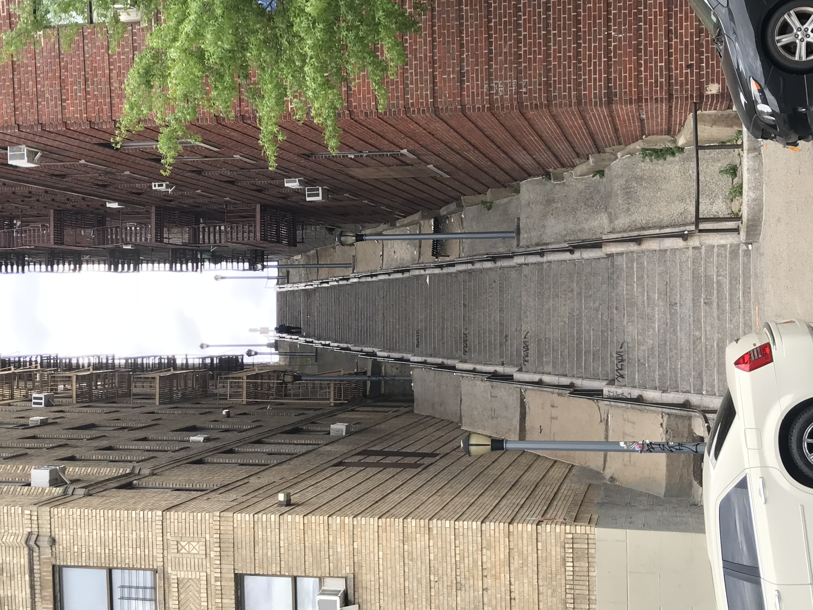

Last Updated: June 20, 2023

[Fluids and Blood Products](https://docs.google.com/presentation/d/1F30u3_w-o6_zAfaI812f5Y8wDeQzbVNWazm2rGHbwiA/edit?usp=sharing)

[Intra-aortic Balloon Pumps](https://docs.google.com/presentation/d/1DN0Maluxe8i_izgy4co4nnSDHUU9w2JCyTyx70_KBHs/edit?usp=sharing)

[Postoperative Vasoplegia](https://docs.google.com/presentation/d/16SXXfynVghB8YQKg1XxakC96fkN4NiWJbF84WSyh4VM/edit?usp=sharing)

[Burns, Poisoning, and Drowning - Periop Considerations](https://docs.google.com/presentation/d/1zKzRpVWhYoBqVLCwArJghcvsALpx8NCneDVFQwhYSRY/edit?usp=sharing)