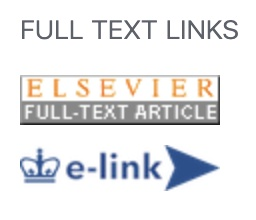

_Last updated November 3, 2023_

Publications which have been supported by U.S. federal agencies (e.g. those which are funded by NIH grants) are freely accessible to the public. These can easily be found with simple searches, i.e. on [Google](https://www.google.com/) or [PubMed](https://pubmed.ncbi.nlm.nih.gov/). Publications which have been supported by private organization (e.g. those supported by individual university or industry sources) may require accessing journal content behind a paywall.

Columbia University students and employees (for example, CUIMC Department of Anesthesiology staff and trainees) can access full-text versions of journal articles via the Columbia University [Augustus C. Long Health Sciences Library](https://library.cumc.columbia.edu/) as follows:

1. Go to the [Augustus C. Long Health Sciences Library webpage](https://library.cumc.columbia.edu/)
2. Click "PubMed"
3. Log in using your Columbia University UNI and Password. 
 _Note: this may be different than your NewYork-Presbyterian Hospital CWID and password and may require multifactor authentication (i.e. DuoMobile)._ 
4. Search within PubMed for your specific article of interest.
5. Once identified, click one of the options within "Full Text Links", often the specific journal's website or <b>Columbia e-link</b>. (If using e-link, you will typically need to select "Get Article" on the next page).

